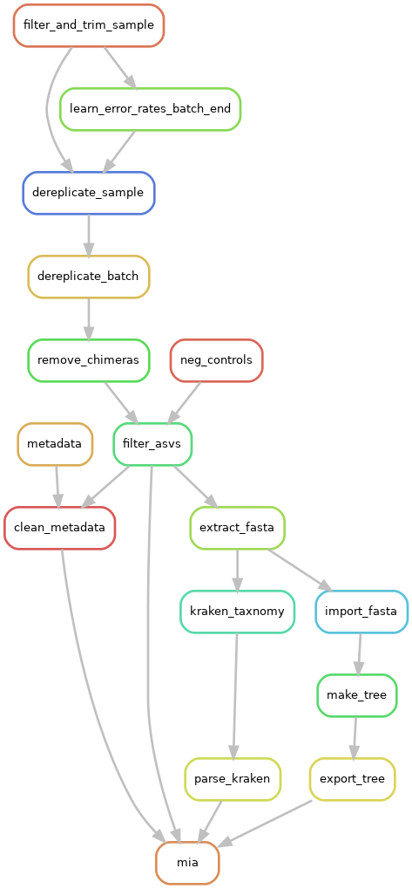

# Snakemake workflow: Dada2

[](https://snakemake.bitbucket.io)
[](https://benjjneb.github.io/dada2/index.html)
<!-- [](https://travis-ci.org/snakemake-workflows/amplicon-seq-dada2) -->

This workflow is an implementation of the popular DADA2 tool. I followed the steps in the [Tutorial](https://benjjneb.github.io/dada2/tutorial.html). I utilized [Kraken2](https://ccb.jhu.edu/software/kraken2/) for ASV sequence classification instead of IDTaxa.


The pipeline was inspired by the [Silas Kieser (@silask)'s dada2 snakemake pipeline](https://github.com/SilasK/16S-dada2).

## Authors

* Rene Welch (@ReneWelch)

## Install workflow

There are two steps to install the pipeline:

1. **Install snakemake and dependencies:** Assuming [conda](https://docs.conda.io/en/latest/) is already installed, and a copy of this repository has been downloaded. Then, the pipeline can be installed by:

    ```sh
    conda env create -n {env_name} --file dependencies.yml
    conda env create -n microbiome --file dependencies.yml
    ```

2. **Install R packages:** To install the R packages used by this pipeline use:

    ```sh
    R CMD BATCH --vanilla ./install_r_packages.R
    ```

## Run workflow

The input for the pipeline are the sequencing files separated by batch in the `data/` directory. Using:

```sh
Rscript ./prepare_sample_table.R
```

Will generate the `samples.tsv` file that contains 4 columns:

```txt
| batch | key | end1 | end2 |
```

separated by a tab space. Then, we can use different commands in the pipeline, for example considering 16 threads:

* `snakemake -j{cores}` runs everything
* `snakemake -j{cores} all_qc` plots quality profiles, and build a `multiqc` report
* `snakemake -j{cores} dada2` computes the ASV matrix from the different batches
* `snakemake -j{cores} all_taxonomy_kraken` to labels the ASV sequences with [kraken2](https://ccb.jhu.edu/software/kraken2/). Databases need to be downloaded from <https://benlangmead.github.io/aws-indexes/k2>
* `snakemake -j{cores} phylotree` computes the phylogenetic tree using `qiime2`'s FastTree
* `snakemake -j{cores} mia` prepare the `TreeSummarizedExperiment` containing all the data generated




## Cite

### dada2

Callahan, B., McMurdie, P., Rosen, M. et al. DADA2: High-resolution sample inference from Illumina amplicon data. Nat Methods 13, 581–583 (2016). https://doi.org/10.1038/nmeth.3869

### Kraken2

Wood, D., Lu, J., Langmead, B. Improved metagenomic analysis with Kraken 2. Genome Biology 20, 257 (2019). https://doi.org/10.1186/s13059-019-1891-0

### phyloseq

McMurdie, P., Holmes, S. phyloseq: An R Package for Reproducible Interactive Analysis and Graphics of Microbiome Census Data. PLOS One 8, 4 (2013). https://doi.org/10.1371/journal.pone.0061217

### qiime2

Bolyen, Evan, Jai Ram Rideout, Matthew R. Dillon, Nicholas A. Bokulich, Christian Abnet, Gabriel A. Al-Ghalith, Harriet Alexander, et al. 2018. “QIIME 2: Reproducible, Interactive, Scalable, and Extensible Microbiome Data Science.” e27295v2. PeerJ Preprints. https://doi.org/10.7287/peerj.preprints.27295v2.

### FastTree

Price, Morgan N., Paramvir S. Dehal, and Adam P. Arkin. 2010. “FastTree 2--Approximately Maximum-Likelihood Trees for Large Alignments.” PloS One 5 (3): e9490.
